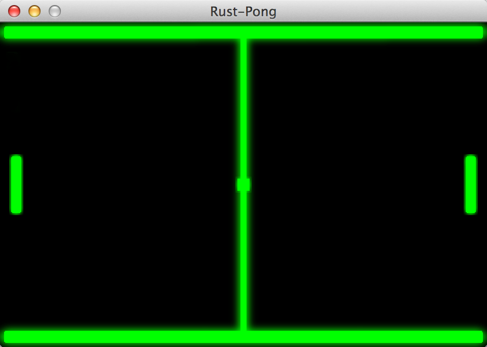

rust-pong
=========

A pong clone in Rust using the Piston game engine.

How to play
-----------
Use `Space` to emit the ball.
Use `Up` and `Down` to control player.



## Building Instructions

Clone [piston-workspace](https://github.com/PistonDevelopers/piston-workspace) and build it (You can follow the instructions in that repo).

Copy all the `syslink` files to 'target/cpu-vendor-os/lib/':

In the Terminal window, navigate to the project folder and type:

```
make run
```

